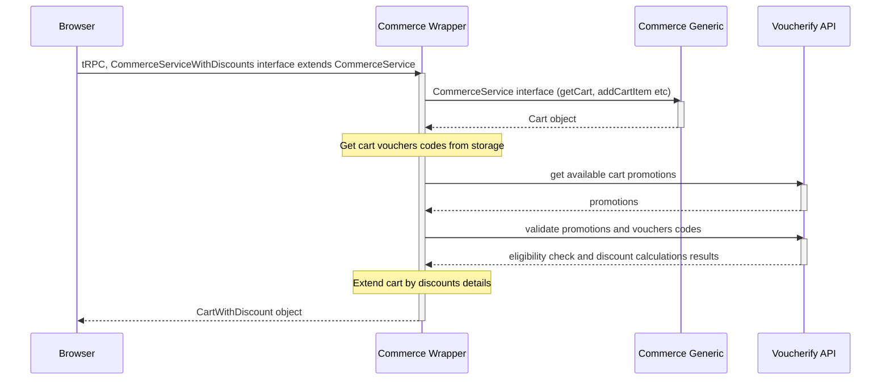

# Voucherify Integration
  
Voucherify is an API-first Promotions and Loyalty Engine that helps brands run personalised coupons, gift cards, auto-applied promotions, loyalty programs, and referral campaigns. This integration focuses on educating people about using Voucherify in composable commerce to enhance advanced promotions capabilities.

## Integration architecture

To extend the storefront by promotion capabilities, Voucherify integration:
1. wrap commerce-generic service extending server API by additional methods and data related to marketing promotions,
2. provides additional UI components that allow users to manage coupons and auto-applied promotions

Voucherify commerce wrapper implements a standard checkout integration pattern, where for each cart update, the wrapper makes Validation (eligibility check, discount calculations) and Qualification (list of applicable promotions) requests to Voucherify REST API. Collected pieces of information extend cart data.

  



## Reference Files

### Backend files

- `packages/voucherify`: This package contains services used to wrap commerce-generic services and communicate to the Voucherify REST API.

### React Components

- `composable-ui/src/components/forms/coupon-form.tsx`: Form to manage coupons, gift and loyalties cards
- `composable-ui/src/components/cart/cart-promotions.tsx`: Display auto-applied cart promotions

## Integrating Voucherify with Composable UI

1. [Create a Voucherify account](https://app.voucherify.io/#/signup).
2. In Voucherify Dashbioard, [set Discount Application Rule to "Partial"](https://support.voucherify.io/article/604-stacking-rules#application-rules)
3. Retrieve your API keys from your Voucherify dashboard and set the following environment variables:

:::caution

Ensure you never expose your Voucherify API keys in the NEXT_PUBLIC_* environment variables or client-side code. Take the necessary steps to ensure that secret keys are never disclosed to the public.
:::

```bash
VOUCHERIFY_API_URL=https://api.voucherify.io
VOUCHERIFY_APPLICATION_ID=xxxxxxxx-xxxx-xxxx-xxxx-xxxxxxxxxxxxx
VOUCHERIFY_SECRET_KEY=xxxxxxxx-xxxx-xxxx-xxxx-xxxxxxxxxxxxx
```

## Populating the Products Using the Script

To configure product base promotions in Voucherify, propagate product definitions to your Voucherify account:

1. Open the terminal and navigate to the `scripts` directory.
2. In the `scripts` directory, run the following command:
  ```
  pnpm install
  ```
3. To set up Algolia, run the following command:
  ```
  pnpm voucherify-setup
  ```

For more information about the configurations, see the [Application Configuration](essentials/configuration.md) section.

## Related Resources

- [Application Configuration](essentials/configuration.md)
- [Mono-repository](essentials/monorepo.md)